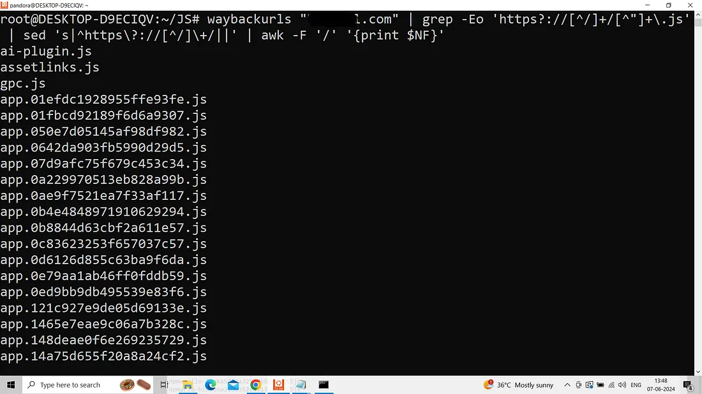

# Js Hunting Methodology

1. Tools for finding Javascript Files

<details>

<summary>Tools</summary>

1. Hakrawler - [https://github.com/hakluke/hakrawler](https://github.com/hakluke/hakrawler)
2. Crawley - [https://github.com/s0rg/crawley](https://github.com/s0rg/crawley)
3. Katana - [https://github.com/projectdiscovery/katana](https://github.com/projectdiscovery/katana)
4. LinkFinder - [https://github.com/GerbenJavado/LinkFinder](https://github.com/GerbenJavado/LinkFinder)
5. JS-Scan - [https://github.com/zseano/JS-Scan](https://github.com/zseano/JS-Scan)
6. LinksDumper - [https://github.com/arbazkiraak/LinksDumper](https://github.com/arbazkiraak/LinksDumper)
7. GoLinkFinder - [https://github.com/0xsha/GoLinkFinder](https://github.com/0xsha/GoLinkFinder)
8. BurpJSLinkFinder - [https://github.com/InitRoot/BurpJSLinkFinder](https://github.com/InitRoot/BurpJSLinkFinder)
9. urlgrab - [https://github.com/IAmStoxe/urlgrab](https://github.com/IAmStoxe/urlgrab)
10. waybackurls - [https://github.com/tomnomnom/waybackurls](https://github.com/tomnomnom/waybackurls)
11. gau - [https://github.com/lc/gau](https://github.com/lc/gau)
12. getJS - [https://github.com/003random/getJS](https://github.com/003random/getJS)
13. linx - [https://github.com/riza/linx](https://github.com/riza/linx)
14. waymore - [https://github.com/xnl-h4ck3r/waymore](https://github.com/xnl-h4ck3r/waymore)
15. xnLinkFinder - [https://github.com/xnl-h4ck3r/xnLinkFinder](https://github.com/xnl-h4ck3r/xnLinkFinder)

</details>

2. Initial discovery were like following


```shellscript
subfinder -d domain.com | httpx -mc 200 | tee subdomains.txt && cat subdomains.txt | waybackurls | httpx -mc 200 | grep .js | tee js.txt
```


3. Here is basic list of words I gathered for testing :

<details>

<summary>Js wordlist</summary>

dialogs540f334e628dbce748a8js navigation\_secondary55dfd8fe215f8edecd48js dialogsb18150a252f68f70f0c9js navigation\_secondary147987372ed67d94de50js buttons147987372ed67d94de50js npmangular-animate8f9be52ce8a521f715a3js mainb18150a252f68f70f0c9js navigation7b5ba7de4b5e5fb011c7js dialogs147987372ed67d94de50js appmain7b5ba7de4b5e5fb011c7js main147987372ed67d94de50js buttons7b5ba7de4b5e5fb011c7js npmangulary-focus-store9327d7778ee0d85c3500js mainfb562f3396222d196abfjs breeze7b5ba7de4b5e5fb011c7js breezeb18150a252f68f70f0c9js breeze30886581e43164d9d721js breeze147987372ed67d94de50js navigationb18150a252f68f70f0c9js appmain147987372ed67d94de50js breezeee32c0b1526644e9b562js main7b5ba7de4b5e5fb011c7js dialogs7b5ba7de4b5e5fb011c7js navigationba64bbac173b1d655721js navigation147987372ed67d94de50js navigation\_secondaryb18150a252f68f70f0c9js buttonscf9c75fee1de19837ae7js appmainb18150a252f68f70f0c9js navigation\_secondary7b5ba7de4b5e5fb011c7js modalsb0f4a82ac6f25a46dc71js npmangular-ui-calendar423a597b943dc586730djs npmapollo-angular-link-httpe7a942f9925da8411a4ejs npmangular-ui-switch90766204ecd17b03ca76js appmainaf9ea97e6139d8cd52c2js npmapollo-angular-link-http-common87eff82eb4bc194887bfjs npmapollo-angular22f1de8a666515c86242js npmapollo-cache53668769616dc1466d8djs npmapollo-cache-inmemorydaeb4f1b88a15680fd12js buttonsb18150a252f68f70f0c9js npmangular-ui-bootstrapcd3d849d20f1a4f7dfacjs configjs npmattr-accept81d56f5e133bac14feb5js npmapollo-clientf1fffac92f44507c8f3ajs npmbase64-js61d2367f7816d6fec60fjs npmapollo-utilities9e092209349bda108468js npmaxiosb02cc1c0e336b6ce9d09js app147987372ed67d94de50js npmauth0b681a646eef51d083006js npmbraintree24d4f13fb9a355dadc24js npmbabel5fd8b43fabbd6864e9a2js npmcall-bind0f09a0bd48e4dac9d679js npmbreeze-client-labs03a64fb13d406c33bbc8js appaf9ea97e6139d8cd52c2js npmavailable-typed-arrays558d90654f4d4fc2aa04js npmcharacter-entities-legacy7f4022465f0c9c4a6fabjs npmblueimp-load-image3d0d2393c631d92c5a1ejs npmchartjs-color-stringbd3a54729bf6f60404afjs npmapollo-linka5d82a3252db6d3e8d15js npmaria-hiddena316c352eb617c047815js npmckeditorfde05d6a29366eaf2c71js npmcollapse-white-spacebdd075f4c3faca5c940fjs npmcharacter-reference-invalid2f9cdaeeea24c3f3897ejs npmbail2e238f58e0858fcf0e31js npmcolor-convert101a98cb8d9df306dc12js npmchartjs-color703b6867120bd9ebf784js npmbreeze-client75c1a11b2c8e46de7ce4js

</details>

4. HOW we gonna do :


```bash
waybackurls "site.com" | grep -Eo 'https?://[^/]+/[^”]+\.js' | sed 's|^https\?://[^/]\+/||' | awk -F '/' '{print $NF}'
```


<figure><figcaption></figcaption></figure>

You can see few of the keywords are new and unique. We can curate one js words list from one target and we can use it on new target . For an example,

<figure><figcaption></figcaption></figure>

5. We can use these same keywords on the IPs which you will get from the shodan


```shellscript
ssl.cert.subject.cn:*.target.com + 200
```


then using this ip

<figure><figcaption></figcaption></figure>


```bash
dirsearch -u http://ip/ -w JSFuzz.txt --full-url
```



```bash
curl -s https://app.site.com/config.js | grep -E "environment: 'Production'|storageUrl: 'https://buildxact.blob.core.windows.net/'|googleApiKey: '|appInsightsInstrumentationKey: '|globalApiEndpoint: '|streamChatApiKey: '|auth0ClientId: '|auth0Domain: '|flatfileApiKey: '|webSpellCheckerServiceId: '|webSpellCheckerServiceUrl: '|clientPortalUrl: '|appVersion: '|appVersionDate: '|appDomainUrl: '|oneBuildKey: '|flatfilePlatformPublishableKey: '|flatfilePlatformEnvironmentId: '" | sed "s/.*’\(.*\)’.*/\1/"
```


<details>

<summary>We can add the words which we think they are sensitive</summary>

ANACONDA\_TOKEN=\
ANALYTICS=\
ANDROID\_DOCS\_DEPLOY\_TOKEN=\
android\_sdk\_license=\
android\_sdk\_preview\_license=\
ANSIBLE\_VAULT\_PASSWORD=\
aos\_key=\
aos\_sec=\
API\_KEY\_MCM=\
API\_KEY\_SECRET=\
API\_KEY\_SID=\
API\_KEY=\
API\_SECRET=\
APIARY\_API\_KEY=\
APIDOC\_KEY\
APIGW\_ACCESS\_TOKEN=\
apiKey\
apiSecret\
APP\_BUCKET\_PERM=\
APP\_ID=\
APP\_NAME=\
APP\_REPORT\_TOKEN\_KEY=\
APP\_SECRETE=\
APP\_SETTINGS=\
APP\_TOKEN=\
appClientSecret=\
APPLE\_ID\_PASSWORD=\
APPLE\_ID\_USERNAME=\
APPLICATION\_ID\_MCM=\
APPLICATION\_ID=\
applicationCacheEnabled=\
ARGOS\_TOKEN=\
ARTIFACTORY\_KEY=\
ARTIFACTORY\_USERNAME=\
ARTIFACTS\
ARTIFACTS\_AWS\_ACCESS\_KEY\_ID=\
ARTIFACTS\_AWS\_SECRET\_ACCESS\_KEY=\
ARTIFACTS\_BUCKET=\
ARTIFACTS\_KEY=\
ARTIFACTS\_SECRET=\
ASSISTANT\_IAM\_APIKEY=\
ASYNC\_MQ\_APP\_SECRET

</details>


```shellscript
grep -r -E "aws_access_key|aws_secret_key|api key|passwd|pwd|heroku|slack|firebase|swagger|aws_secret_key|aws key|password|ftp password|jdbc|db|sql|secret jet|config|admin|pwd|json|gcp|htaccess|.env|ssh key|.git|access key|secret token|oauth_token|oauth_token_secret" /path/to/directory/*.js
```


6. To run a Nuclei command on the `js.txt` file with the `exposures` tag, you can use the following command:


```shellscript
nuclei -l js.txt -t ~/nuclei-templates/exposures/ -o js_exposures_results.txt
```


