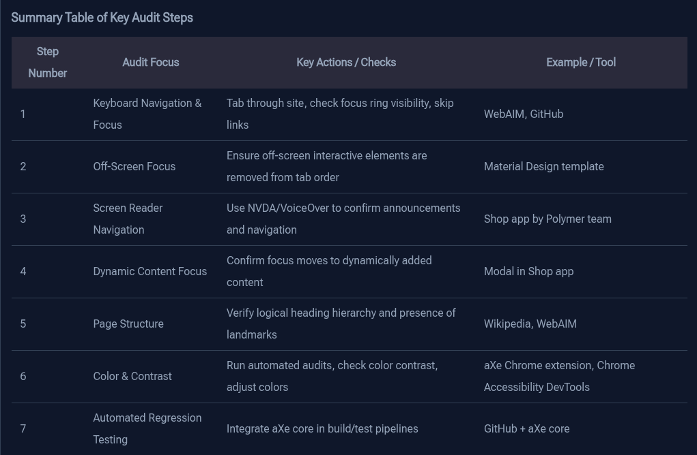

# 🍳 Accessibility Testing (A quick review)

## To identify major accessibility pitfalls

### Keyboard Navigation and Focus Styles

* The first step in the audit is to test if the website can be navigated using the Tab key on the keyboard.
* Use WebAIM as an example, a well-known web accessibility resource site. **Key focus is on:**

1. Presence of discernible focus styles (visible focus ring or highlight) on interactive page elements.
2. The existence of a skip link that allows keyboard users to bypass repetitive navigation and jump directly to main content.
3. WebAIM’s skip link appears on the first Tab press in the top-left corner, an important accessibility feature also found on sites like GitHub.
4. WebAIM demonstrates an excellent implementation of focus rings, even animating them, which Rob praises as “the best tab-focused behavior” he has seen.

### Ensuring Focus Is Not Trapped in Off-Screen Content

* Examine if off-screen interactive content is inappropriately focusable.
* When resizing the browser, focus can move into off-screen elements that are hidden visually but still accessible via keyboard tabbing. _This is problematic because:_
  * [ ] Keyboard users can get “trapped” or confused by invisible interactive elements.
  * [ ] Mobile screen readers might navigate into these off-screen elements erroneously.
* The audit checks that off-screen interactive elements are removed from the tab order or disabled appropriately to prevent accidental focus.

### Screen Reader Navigation Check

* [ ] For testing the site with at least one screen reader to ensure a basic level of screen reader accessibility.
* [ ] Familiarity with screen readers such as NVDA (Windows) or VoiceOver (Mac) is recommended for developers to perform quick sanity checks on their pages.
* [ ] The screen reader test includes:
* [ ] Navigating through links and interactive elements to confirm they are announced properly.
* [ ] Checking that images have descriptive alt text instead of just file names.
* [ ] Verifying that custom controls (e.g., buttons made from divs or custom elements) are keyboard accessible and properly announced by the screen reader. **Example**: A dropdown control was tested to confirm it correctly announces its state (e.g., "size collapsed pop up button") and allows keyboard interaction (arrow keys to select options).

### Dynamic Content and Focus Management

* Manage focus when dynamic content appears, such as modals or notifications. For example: When an item is added to the cart, a modal-like message appears and the screen reader focus is programmatically moved into that notification.
* This is typically done by setting the element’s tabindex to -1 and calling focus on it, ensuring screen reader users are alerted to changes.
* Proper focus management on dynamic updates is a key accessibility consideration.

### Page Structure: Headings and Landmarks

* Auditing the page structure is crucial for screen reader users to navigate efficiently. Example: WebAIM uses landmarks well, enabling screen reader users to bypass navigation and jump straight to main content.

### Color and Contrast Checks

* [ ] Ensure text color contrast meets accessibility standards for users with low vision impairments. **Tools recommended:**
* [ ] aXe Chrome extension (by Deque Systems) to run automated accessibility audits including color contrast.
* [ ] Chrome Accessibility DevTools extension, which highlights low-contrast elements and suggests alternative color values that meet WCAG guidelines. **These tools allow developers to:**

1. Identify problematic elements quickly.
2. Preview improved color choices inline by modifying CSS color values directly in the browser tools.
3. Color contrast is a fundamental accessibility requirement that is simple to verify and fix.

### Automated Accessibility Regression Testing

* Integrate automated accessibility testing into the development build process to catch regressions early.
* The underlying library for the aXe Chrome extension is aXe core, which can be used programmatically in test suites. **This setup allows:**
* Running accessibility audits on sample pages during automated tests.
* Automatically failing tests when accessibility violations are detected, prompting fixes before deployment. This approach fosters continuous accessibility compliance and prevents issues from reappearing unnoticed.

<figure><figcaption></figcaption></figure>
